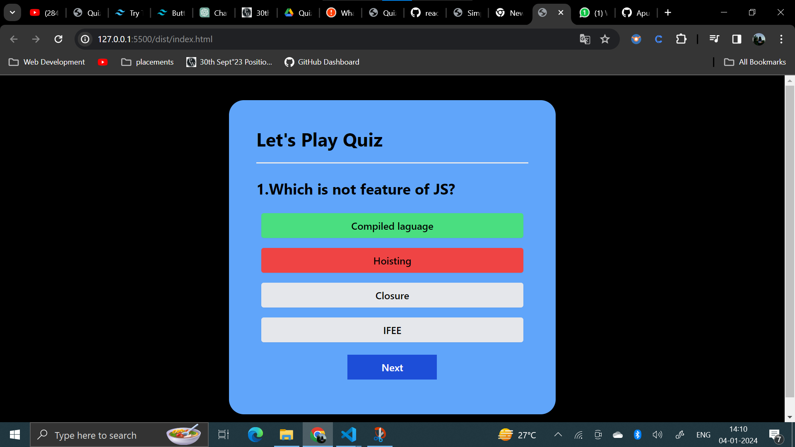

# Quiz Application

This quiz application is a simple web-based quiz built using HTML, Tailwind CSS for styling, and JavaScript for functionality. It presents a set of multiple-choice questions and allows users to select answers, providing instant feedback on correctness and updating the score accordingly.

[Take the Quiz Now](https://apurwa-rokade.github.io/Quiz-App/)
## Features

- **Quiz Structure:** Contains a set of multiple-choice questions with options.
- **User Interaction:** Allows users to select options for each question.
- **Selection Feedback:** Provides visual feedback (color indication) for correct and incorrect answers.
- **Score Update:** Updates the score for correct answers.
- **Quiz Restart:** Allows users to restart the quiz upon completion.

## Tech Stack Used

- **HTML:** Used for structuring the content of the quiz application.
- **Tailwind CSS:** Preferred CSS framework for styling the application.
- **JavaScript:** Implements the quiz logic, user interaction, and scoring functionality.

## Usage

1. **Clone the Repository:**
   ```bash
   git clone https://github.com/Apurwa-Rokade/Quiz-App.git
   cd quiz-application
